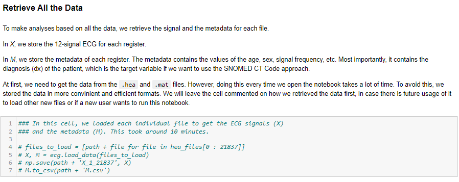

# Datos

En esta carpeta se deben almacenar y/o generar los datos para correr los *notebooks*.

En la carpeta [PTB-XL](<PTB-XL>) se deben guardar los archivos *.hea* y *.mat* contenidos en [Physionet](<https://physionet.org/content/ptb-xl/1.0.3/>). Al final de la página se encuentran múltiples archivos. Los que se requiere descargar son los que están dentro de la carpeta *records500*, que son los que tienen una frecuencia de muestreo igual a 500. Se incluyen algunos ejemplos de como se espera que se guarden los archivos en esta carpeta.

Hay algunos otros archivos que sí se pudieron almacenar aquí dado su bajo requerimiento de memoria. No obstante, todos los que tienen un peso elevado deben ser calculados de nuevo una vez que se hayan bajado los insumos iniciales desde *Physionet*. En ambos *notebook* hay varias celdas comentadas, o que al principio tienen una estructura del estilo "*if file not in files:*". Al correr el notebook, hay que descomentar dichas celdas para que se puedan empezar a generar los datos. Por ejemplo, la primera instancia de esto ocurre en el *notebook* de [exploración](<../ecg-eda-ptbxl-v3.ipynb>), en el cual se detalla que antes se cargaban siempre los datos desde sus archivos originales, pero esto implicaba mucho tiempo en cada iteración, por lo que se optó por guardar todos los registros en un archivo *.npy*. Esa celda hay que descomentarla y correrla para que se guarden todos los datos en el archivo *X_1_21837.npy*:

 Otro ejemplo más adelante es cuando se corrige el ruido por *baseline drift*. Los registros tras una pasada de filtro de mediana también se almacenan pues correr dicho filtro para todos es muy tardado. Estos se guardan en la carpeta [PTB-XL_mf=200](<PTB-XL_mf=200>), archivo por achivo, y después se guardan de la misma forma que los originales en un archivo *.npy*. Y así para todos los datos que deberían estar contenidos en esta carpeta para que ambos *notebooks* corran sin fallas.

Cabe mencionar que el tiempo requerido para generar todos los datos puede ser elevado, e igualmente puede ser un costo computacional importante. Si alguno de los procesos para guardar datos llega a fallar por memoria, se recomienda alterar las celdas para que se reduzca el número de registros procesados al mismo momento, y luego juntar cada uno de los registros independientes.